<!-- SARUF RATUL | GitHub Profile | 2026 -->
<!-- prettier-ignore-start -->
<!-- markdownlint-disable -->

  

  

  

  

  
  
  

  
  
  
  
  

  
  
  
  
  

  

  

  

  

  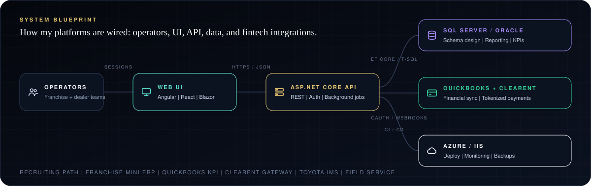

  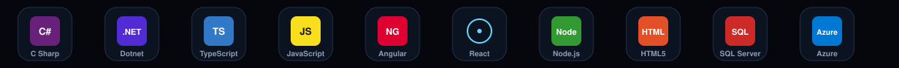

  

  

  

  

  

<strong>Earlier platforms</strong> - banking payroll, realtime chat, commerce

 
<table align="center">
  <tr>
    <td align="center" width="33%">
      <strong>People Hub</strong> 
      ERA Infotech  
      HR / payroll for Bank Asia, IFIC, and SBL 
      ASP.NET Core | Angular | Oracle 12c | Nginx
    </td>
    <td align="center" width="33%">
      <strong>Realtime chat</strong> 
      Glo.Bu.S, Italy  
      One-to-one messaging platform 
      React | Node | Socket.IO | MongoDB
    </td>
    <td align="center" width="33%">
      <strong>ERP and e-commerce</strong> 
      E-Tex / BitByte  
      Web products, delivery, and small-team leadership 
      Web | ERP | Commerce
    </td>
  </tr>
</table>

  

  

  

  

  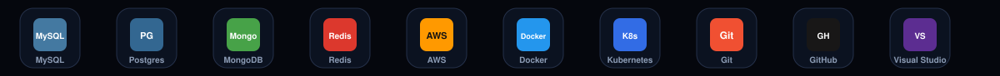

  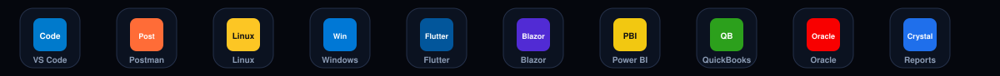

  

  

  

  

  

  

  

  

  

  

<strong>Certifications and training</strong>

 
<table align="center">
  <tr>
    <td align="center" width="25%">
      <strong>Cloud</strong> 
      AWS Cloud | Oracle Cloud Infrastructure
    </td>
    <td align="center" width="25%">
      <strong>Delivery</strong> 
      Scrum | Project management
    </td>
    <td align="center" width="25%">
      <strong>Courses</strong> 
      Microsoft back-end / ASP.NET | Udemy: Chat Application
    </td>
    <td align="center" width="25%">
      <strong>HackerRank</strong> 
      REST API (Intermediate) | Java | JavaScript | Problem Solving
    </td>
  </tr>
</table>

  

  

  

  
  
  
  

  
  
  
  
  

  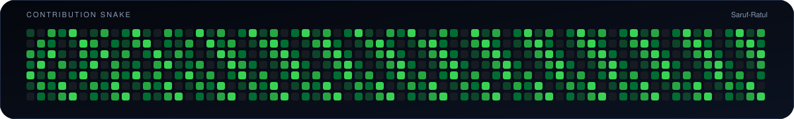

  

  

<!-- prettier-ignore-end -->
